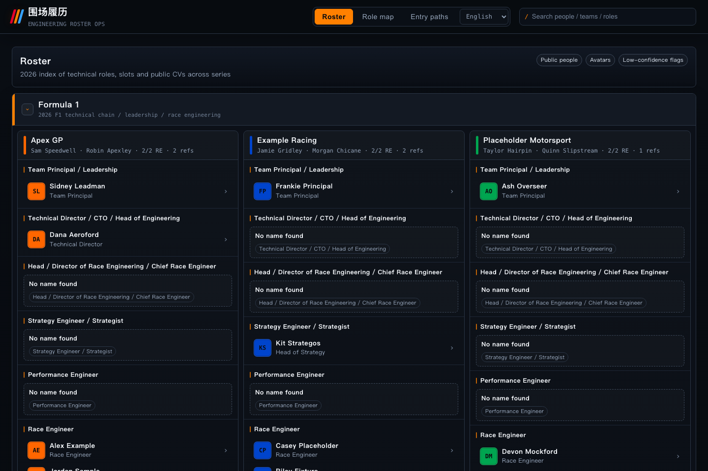

# paddock-cv

> Reverse-engineering how people actually get paddock jobs — a sourced career-path
> atlas of the publicly identifiable trackside engineering staff across F1, F2,
> WEC / Le Mans, Formula E and F1 Academy.

[](https://github.com/gaoflow/paddock-cv/actions/workflows/ci.yml)
[](LICENSE)
[](#-data-notice)
[](#quickstart)
[](https://paddockcv.com)

English | [简体中文](./README.zh-CN.md)

**▶ [paddockcv.com](https://paddockcv.com)** — the site itself, running the full
real dataset (~480 people, 5 series) in 7 languages. This repo is how it's built.

**Know a paddock engineer the site is missing (or shows wrong)?**
[Open a person-info issue](../../issues/new?template=person-info.yml) with a
source URL — sourced contributions flow straight into the live site.
Contact: [hello@paddockcv.com](mailto:hello@paddockcv.com)

<!-- screenshot: docs/img/dashboard-sample.png — the live site (paddockcv.com); the repo itself ships only the fictional sample dataset -->


Pick a paddock job. Find everyone who currently holds it. Read how each of them
got there. That is the whole method — this repo is the tooling and methodology
that made it repeatable at the scale of ~480 people across five series.

**What's here**

- **A research pipeline, not a scraper** — role-by-role identification from
  official team pages, series "people" features, alumni spotlights and
  editorial interviews, with per-claim source URLs and an audit log of every
  accept/reject decision.
- **A career-ladder data model** — person → education → career entries →
  role assignment → sources, compiled to JSON and seeded into SQLite.
- **A single-file dashboard** (`web/index.html`, zero build step) — roster
  board for five series, role map, entry-route analytics, per-person CV
  drawer. UI localised into 7 languages.
- **The methodology docs** — how to search, how to bind a photo to an
  identity without misattribution, when to stop and record "not public".
- **Playwright regression tests** that run against the sample dataset.

The real dataset (~480 living people's aggregated career histories and cached
editorial photos) stays out of this repository for privacy and copyright
reasons. `data/sample/` ships a structurally identical, obviously fictional
dataset (*Alex Example*, fake teams, `example.com` sources) so everything runs
out of the box. Not affiliated with the FIA, Formula 1, FOM, or any team.

## Quickstart

Requires Python 3.10+ (stdlib only — no pip installs) and optionally Node 20+
for the tests.

```bash
git clone https://github.com/<you>/paddock-cv.git
cd paddock-cv

python3 scripts/make_sample_data.py                     # generate the fictional dataset
F1E_DATA_DIR=data/sample python3 scripts/build_data.py  # compile web/data.json + data.js
F1E_DATA_DIR=data/sample python3 scripts/seed_db.py     # build the SQLite layer
F1E_DATA_DIR=data/sample python3 server.py              # serve on http://localhost:8000
```

Tests (Playwright, against the sample dataset):

```bash
npm install
npx playwright install chromium
npm test
```

## How the research works

The four-layer loop, per role:

| Layer | Question | Primary sources |
|---|---|---|
| L1 Role | What does this job do, where does it sit? | Team careers blogs, editorial interviews |
| L2 Roster | Who holds it at every team this season? | Season previews, team announcements, broadcast mentions — ≥2 independent sources |
| L3 CV | How did each person get there? | LinkedIn public summaries, university alumni features, series "People of the Paddock" columns |
| L4 Assets | Photo, with identity actually verified? | Official team CDNs with named captions, single-subject interview leads — see the binding-strength spectrum |

The search layer is AI-assisted: LLM research agents drive the role-by-role
queries through **[Tavily](https://tavily.com)** (search + full-page reading)
and **[Firecrawl](https://firecrawl.dev)** (structured extraction), surfacing
candidate sources at a scale one human can't. Judgment stays human-shaped:
agents only *propose*; every accept/reject goes through the sourcing rules
below, and every claim keeps its URL so you can re-verify without trusting
the pipeline at all.

Two rules carry the whole thing:

1. **Absence over fabrication.** If it can't be sourced, the field stays
   empty and the gap is recorded as data. A wrong face is worse than initials.
2. **Every accept/reject is logged.** The audit table (`lookup_runs`) is part
   of the dataset, so coverage claims are checkable.

Full write-ups: [docs/SEARCH_METHODOLOGY.md](docs/SEARCH_METHODOLOGY.md) ·
[docs/DATA_METHOD.md](docs/DATA_METHOD.md) ·
[docs/ROUTES.md](docs/ROUTES.md) (findings summary).

## Repository layout

```
scripts/
  make_sample_data.py   generate the fictional demo dataset
  build_data.py         compile data dir → web/data.json + web/data.js
  seed_db.py            build the SQLite layer (people/roles/assignments/sources)
  build_i18n_overlays.py merge translated content → web/i18n/<locale>.json
server.py               static frontend + JSON API (stdlib http.server)
web/index.html          the entire frontend (no build step)
tests/                  Playwright regression suite
docs/                   methodology + findings
data/sample/            fictional demo data (the only data that ships)
```

## Data model

Everything compiles into one JSON payload and one SQLite database:

- `people` / `education_entries` / `career_entries` — the CV core, every entry
  carrying `source_url` + `source_title`.
- `assignments` — person × team × role × season, including explicit
  `role_exists_name_not_public` placeholder rows so publication gaps are
  first-class data, not silence.
- `sources`, `person_sources`, `assignment_sources` — the citation graph.
- `photos` — local path, credit, licence and a provenance note per person.
- `lookup_runs` — the append-only audit log of every search decision.

## Findings (from the real dataset)

From the 26 race-engineer CVs on the 2026 F1 grid: **15/26** came up through
university → junior formulae (F4/F3/F2 or Formula Renault) → F1;
**8/26** entered via data/performance engineering and converted to the race
engineer seat later; motorsport-specific MSc programmes (Cranfield, Oxford
Brookes) recur far more than any other credential. The methodology docs show
how to reproduce these numbers for any other paddock role.

## Limitations & ethics

- **Public sources only.** Nothing behind logins, no scraping of gated
  profiles, no contact with subjects.
- **Aggregation is the risk.** Each fact is public; the compilation is what
  stays private. That boundary is the point of the code/data split.
- **Right to removal.** If you are documented in someone's private dataset
  built with this tooling, that's between you and them — but the reference
  pipeline records provenance for every claim precisely so removals are easy.
- **Photos are never redistributed.** The pipeline stores them locally with
  full provenance; the licence does not and cannot cover them.

## Agent skill

The dashboard's layout system and search behavior are documented as a reusable
agent skill in [`skills/paddock-dashboard/SKILL.md`](skills/paddock-dashboard/SKILL.md)
— drop it into your agent's skills directory to build (or extend) a
Paddock-CV-style roster UI: Apple-dark tokens, team cards, person rows,
hash-routed CV drawer, and the single-input live search.

## Contributing

**Know something about a paddock engineer that the site is missing?** That's
the most valuable contribution there is — open a
[person-info issue](../../issues/new?template=person-info.yml) with what you
know and a source URL. Verified contributions go into the private dataset
that powers [paddockcv.com](https://paddockcv.com).

Code and methodology PRs are equally welcome — see
[CONTRIBUTING.md](CONTRIBUTING.md). The repo's files ship only the fictional
sample dataset; real-person info flows through issues, not PRs.

Anything else (removal requests, press, questions):
[hello@paddockcv.com](mailto:hello@paddockcv.com).

## License

- **Code & docs:** [MIT](LICENSE).
- **Sample data** (`data/sample/`): [CC0](https://creativecommons.org/publicdomain/zero/1.0/) — it's fictional.
- **Real datasets you build with this tooling:** yours, and your
  responsibility. See [Limitations & ethics](#limitations--ethics).
